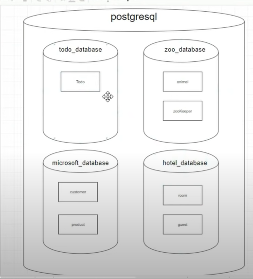

# PostgresSQL 
- \I: list all db in postgresSQL
- \c: move inside a db. 
- \dt: show table in db. 

CREATE DATABASE perntodo => create a database called perntodo

CREATE TABLE todo(..) => creaea a table called todo# pern-stack-crud
